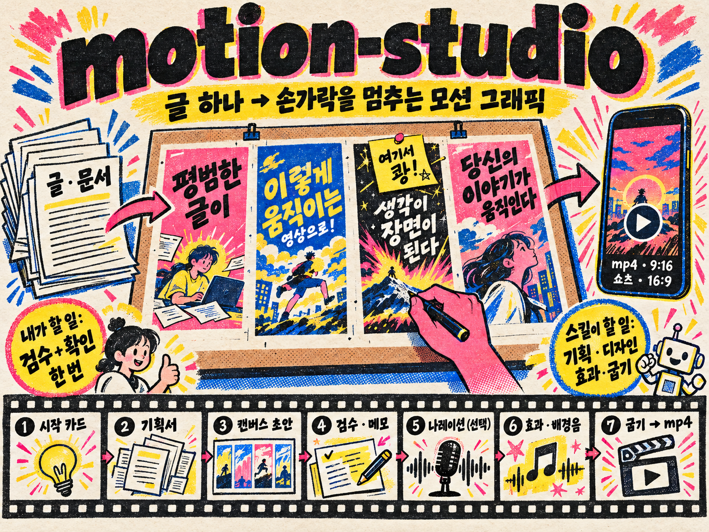

<p align="center">
  
</p>

# motion-studio

> **첫 1초에 손가락을 멈추게 하고, 끝까지 눈을 못 떼게 만든다.**

글이나 문서를 주면 **모션 그래픽 영상**(9:16 쇼츠 · 16:9 mp4)을 만들어 주는 Claude 스킬입니다.

바로 영상을 뽑지 않고, 중간에 **Claude Design 캔버스 초안**을 둡니다.
장면을 눈으로 보고, 고치고 싶은 곳은 직접 고치거나 말로 부탁하고, 넣고 싶은 움직임은 메모로 남기면 됩니다.
확정된 캔버스는 파이썬 엔진이 그대로 따라 그리고, 효과 · 전환 · 배경음을 붙여 영상으로 굽습니다.

- 디테일을 직접 만지기 어려운 사람을 위한 스킬입니다 — **최소한의 노력으로 최대의 결과물**
- 내가 할 일은 **캔버스 검수**와 **«굽기 진행할까요?» 한 번 확인**이 전부입니다
- 나레이션은 선택 — 문장 단위 원고를 받아 녹음해 넣으면, 영상이 녹음 길이에 맞춰집니다
- 영상마다 **키트**(움직임 문법 한 벌)를 골라 산만하지 않게, **킥 장치**(되감기 같은 시간 조작) 하나로 기억에 남게 만듭니다

> 현재 버전 **v0.2.1**

---

## 어떻게 흘러가나

```
① 시작 카드      내용 · 비율(9:16 / 16:9) · 나레이션 · 디자인 분위기 · 액션 분위기
② 기획서          무엇을 전할지 정리 (이어 가기 문서)
②-B 표현 기획     콘셉트 · 훅 · 장면마다 보여 주는 방법 · 시각 방향 · 키트 · 킥 장치
③ 캔버스 초안     아트보드 한 장 = 장면 하나
   ⏸ 검수         직접 고치거나 · 말로 부탁하거나 · 메모로 움직임 남기기 → «검수 끝»
④ 정리 · 효과 계획 메모가 먼저, 나머지는 스킬이 키트에서 출발해 장면마다 세기(1~3)를 매겨
⑤ 글꼴 받기       캔버스에 쓴 오픈 글꼴 중 없는 것만
⑥ 나레이션        문장 단위 원고 → 녹음 → 앞뒤 빈 소리 정리   (선택)
⑦ 굽기            점검 모음 · 점검 보고(Claude가 먼저 확인) → ⏸ «굽기 진행할까요?» → mp4
```

| 내가 하는 일 | 스킬이 하는 일 |
|---|---|
| 내용 주기 · 분위기 고르기 | 기획 · 장면 나누기 · 캔버스 디자인 |
| 캔버스 보고 고치기 · 메모 | 메모 반영 · 등장 순서 · 효과 · 전환 · 배경음 |
| (선택) 원고 녹음 | 녹음 정리 · 싱크 |
| «굽기 진행» 한 마디 | 점검 · 굽기 · mp4 전달 |

## 설계 사상 — 스킬은 바닥, 모델이 천장

스킬은 품질이 이 아래로 떨어지지 않게 받쳐 주고, 얼마나 잘 만드느냐는 모델이 정합니다. 모델이 좋아지면 결과도 그대로 좋아집니다.

**늘 지키는 것**
1. 원문에 없는 사실 · 숫자를 지어내지 않는다
2. 폰에서 읽힌다 (핵심 글자 크기 · 쇼츠 안전 영역)
3. 캔버스에서 확정한 모습(요소의 자리 · 크기 · 글자 · 색)이 영상에 그대로 나온다 — 카메라는 그 화면을 찍는 방법
4. 굽기 전 확인은 한 번
5. 내 메모가 스킬의 판단보다 먼저

**막지 않는 것** — 효과 개수 · 횟수 상한을 두지 않습니다. 효과 사전(32종)은 검증된 재료이지 메뉴가 아니고, 엔진이 못 그리는 디자인이 필요하면 엔진을 늘립니다. **키트도 같은 결입니다 — 일관성을 지키는 최소한의 바닥이지 제한이 아닙니다.**

## 카메라 · 편집

장면마다 «어떻게 찍을지»와 «어떻게 이을지»를 정합니다. 영상은 «요소가 나타나는 것»이 아니라 «찍고 잇는 것»입니다.

- **찍기** — 밀고 들어가기 · 빠지며 공개 · 훑기 · 시선 옮기기 · 끊어 다가가기(펀치 인 컷) · 점프 컷 · 천천히 흐르기 · 기울기 · 손에 든 카메라 · 빠른 줌 · 초점 옮기기 · 깊이(패럴랙스)
- **잇기** — 컷 · 디졸브 · 딥(검정 · 흰) · 플래시 · 밀어내기 · 덮기 · 걷어내기 · 줌 전환 · 흐려졌다 바뀜 · 돌며 바뀜 · 띠로 갈라짐 · 매치 컷
- **센 전환** — 색 갈라짐 · 쾅 착지 · 방사형 흐림 · 정육면체 · 블라인드 · 모자이크 · 불타듯 번짐 · 시계 바늘 · 늘어나며 밀기 · 타일 뒤집기 · 떨어져 튀기 + 효과 사전의 전환 8종
- **화면이 바뀔 만큼** — 장면마다 크게 움직이는 카메라를 하나 이상 둡니다. 살짝 다가가기만으로는 움직임이 느껴지지 않기 때문입니다. 장면 끝 화면은 전체 · 요소 가운데 · 이유 있는 삼분할 중 하나로 맞춥니다.

## 키트 — 움직임의 문법 한 벌

재료가 많을수록 이것저것 섞여 산만해지기 쉽습니다. 그래서 **영상끼리는 키트로 다르게, 한 영상 안은 키트에서 출발해 변주**합니다.
키트는 일관성을 지키는 **최소한의 바닥이지 제한이 아닙니다** — 내용에 더 맞는 움직임은 키트 밖에서도 가져오고, 이유만 남깁니다.

| 키트 | 느낌 | 상태 |
|---|---|---|
| 팝 | 경쾌 — 밀어내기 · 정육면체 · 튀어나오기 | 실사용 확인 |
| 시네마 | 강렬 — 빠른 줌 · 손에 든 카메라 · 쾅 착지 | 실사용 확인 |
| 차분 | 감성 — 디졸브 · 초점 옮기기 · 따뜻한 색 | 실사용 확인 |
| 테크 | 디지털 — 글리치 · 한 자씩 · 스캔선 | 실험 |
| 손그림 | 종이 — 손그림 동그라미 · 종이 질감 | 실험 |
| 다큐 | 현장 — 손에 든 카메라 · 바랜 색 | 실험 |

- 키트마다 전환 · 카메라 · 등장 · 강조 · 속도 곡선 · 화면 겹 · 배경음이 한 벌로 묶여 있습니다. 천천히 흐르기 · 밀고 들어가기 · 나타나기 같은 기본 움직임은 모든 키트에 들어 있습니다.
- **세기 지도** — 장면마다 세기 1~3을 매깁니다. 센 장치는 봉우리(훅 · 결과 공개 · 마무리)에만 두고, 장면 사이 전환은 키트가 세기에 맞춰 고릅니다.
- **화면 겹** — 입자 · 비네트 · 스캔선 · 종이 · 색 보정 · 빛 번짐을 영상 전체에 한 겹.

## 시간 조작 — 킥 장치

엔진은 «시각을 주면 그 순간을 다시 그립니다». 그래서 되감기 · 슬로 · 멈춤도 화질 손실 없이 매끄럽고, 배경음 · 효과음도 같은 시간을 따라갑니다(나레이션은 건드리지 않습니다).
한 편에 하나, **이야기 구조일 때** 씁니다 — 같은 출발점에서 갈라지는 두 줄기가 있을 때 되감기가 «원점»으로 읽힙니다.

| 장치 | 잘 맞는 내용 |
|---|---|
| 아니지~ 다시 | 흔한 실수 → 삐! ✕ → 되감기 → 바른 방법 |
| 결과 먼저 → 되감기 | 완성본을 먼저 보여 주고 처음부터 |
| 멈추고 짚기 | «여기가 포인트» |
| 쾅 직전 슬로 · 닿을 듯 → 제자리 | 공개를 한 번 미루는 훅 |
| 빨리 감기 · 되감고 바꿔 보기 · 앞뒤 흔들기 | 과정 압축 · 옵션 비교 · 리듬 |
| 멈춘 채 카메라만 · 끝에서 처음으로 · 편집기 화면과 함께 | 한 순간 훑기 · 쇼츠 무한 반복 · 도구 사용법 |

## 굽기 전 점검

굽기 전에 Claude가 먼저 **점검 모음**(장면마다 세 장) · **움직임 시간 띠** · **점검 보고**를 보고 고친 뒤에 묻습니다. 점검 보고가 짚는 것:

- 센 장치가 몰렸는가(세기 3 연달아 · 너무 잦음) · 같은 등장 · 같은 전환이 되풀이되는가 · 한 장면에 강조가 둘인가
- **카메라가 실제로 얼마나 움직였는가** — 적어 둔 이름이 아니라 엔진이 찍은 배율 · 이동을 재서, 화면이 거의 안 바뀐 장면을 짚습니다
- 2.5초 넘게 멈춘 구간이 있는가
- 키트 밖에서 가져온 것은 벌점 없이 이유와 함께 보여 주기만 합니다

## 캔버스에서 쓸 수 있는 디자인

캔버스는 웹 화면이 아니라 **영상의 한 장면**으로 짓습니다. 엔진이 그대로 따라 그리는 표현:

- 그라데이션(직선 · 원형) · 상자 그림자 · 글자 그림자
- 회전 · 크기 · 반투명 · 흐림
- 속 빈 테두리 글자 · 그라데이션 글자 · 글자 간격
- 화면 밖으로 넘치는 큰 글자 · 그림(cover / contain · 둥근 모서리)
- 오픈 글꼴은 제한 없이 — 캔버스 확정 뒤 쓴 글꼴만 받아 넣으면 됩니다

---

## 설치

1. 이 저장소의 `motion-studio.skill`을 내려받아 Claude(Cowork · Claude Code)에 스킬로 설치합니다.
2. 처음 한 번 점검합니다.

```bash
python3 <스킬 폴더>/scripts/check.py <작업 폴더>
```

필요한 것:

| 항목 | 설치 |
|---|---|
| ffmpeg | `brew install ffmpeg` (맥) · `apt install ffmpeg` |
| Pillow · numpy | `pip install Pillow numpy` |
| tinysoundfont (배경음) | `pip install tinysoundfont` · pyaudio 빌드 오류가 나면 `pip install tinysoundfont --no-deps` |
| pedalboard (배경음 다듬기) | `pip install pedalboard` · 실행 중 죽으면 `pip install "pedalboard==0.9.16"` |
| 사운드폰트 GeneralUser-GS.sf2 (약 31MB) | [내려받기](https://raw.githubusercontent.com/mrbumpy409/GeneralUser-GS/main/GeneralUser-GS.sf2) → 작업 폴더 `sf2/`에 · [안내 페이지](https://www.schristiancollins.com/generaluser) |

사운드폰트는 용량 때문에 스킬에 넣지 않았습니다. 클라우드 작업 공간에서는 Claude가 위 주소로 직접 받습니다. 없어도 배경음 없이 굽기는 됩니다.

- **Claude Design 캔버스(Artifact)** 를 쓸 수 있어야 합니다 — 캔버스 없이는 이 스킬의 흐름이 돌지 않습니다.
- 컴퓨터 폴더를 연결해 쓰는 걸 추천합니다. 클라우드 작업 공간에서도 끝까지 만들어지지만(글꼴은 첨부로 받습니다), 세션이 끝나면 중간 파일(기획서 · 녹음 등)이 사라집니다.

## 쓰는 법

작업 폴더를 정한 뒤 이렇게 부르면 됩니다.

```
이 글로 쇼츠 모션그래픽 만들어줘
motion-studio 시작
```

시작 카드에서 고르고 «시작» → 캔버스가 열리면 보고 고치고 메모 → «검수 끝» → (나레이션을 넣으면) 원고 녹음 → «굽기 진행» → 완성 mp4.

## 하지 않는 것

- 그림을 새로 생성하지 않습니다 (AI 이미지 · 영상 생성 ✕) — 내용 속 그림 · 결과물은 재료로 씁니다
- 녹음을 대신하거나 음성을 합성하지 않습니다
- 업로드 · 오프닝/엔딩은 하지 않습니다 (썸네일은 요청하면 캔버스에 한 장)

## 폴더 구성

```
motion-studio/
├ SKILL.md              스킬 본문 (흐름 · 설계 사상)
├ intro.html            시작 카드
├ reference/            기획서 틀 · 표현 기획 · 캔버스 규칙 · 효과 목차 · 키트 · 시간 조작 · 카메라·편집 · 효과 사전 · 함정
├ scripts/check.py      첫 사용 점검
├ scripts/core/         엔진 — canvas(아트보드 읽기·그리기) · camera(카메라·편집) · appear(등장) · motion(머무는 동안·강조) · fx(효과 32종) · kit(키트·점검) · timewarp(시간 조작) · finish(화면 겹)
│                       · audio(배경음·효과음·믹스) · voice(녹음 정리) · bake(점검 모음·점검 보고·굽기·조각)
├ examples/             장면 코드 본보기 — scenes_example(키트 · 세기 · 경계 편집) · rewind_example(아니지~ 다시)
└ assets/fonts/         Pretendard (OFL) — 본문용 기본 글꼴
```

## 업데이트

| 버전 | 내용 |
|---|---|
| v0.2.1 | 키트는 바닥이지 제한이 아니다 · 점검 보고가 카메라 실제 움직임을 잰다 · 장면 끝 화면 가운데 · 시네마 키트 손질 · 사운드폰트 직통 주소 |
| v0.2.0 | 키트 6종 · 세기 지도 · 시간 조작 11가지 · 점검 보고 · 화면 겹 · 효과 목차 |
| v0.1.7 | 센 전환 11종 |
| v0.1.4 | 카메라 · 편집 엔진 |
| v0.1.0 | 첫 공개 |

## 라이선스 · 크레딧

- 글꼴 Pretendard — SIL Open Font License (`assets/fonts/OFL-Pretendard.txt`)
- 사운드폰트 GeneralUser GS — S. Christian Collins (별도 내려받기 · 무료 · 상업 이용 가능)

---

만든 사람: **Blue** · YouTube [@mjKorea123](https://www.youtube.com/@mjKorea123)
